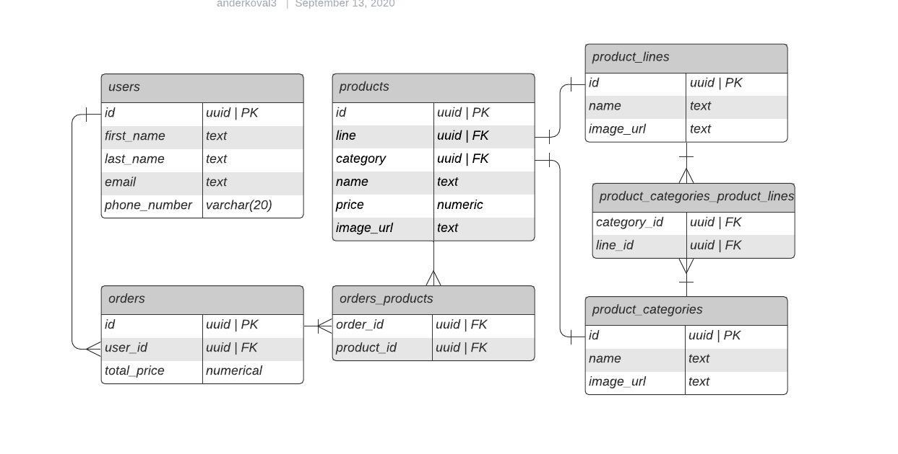
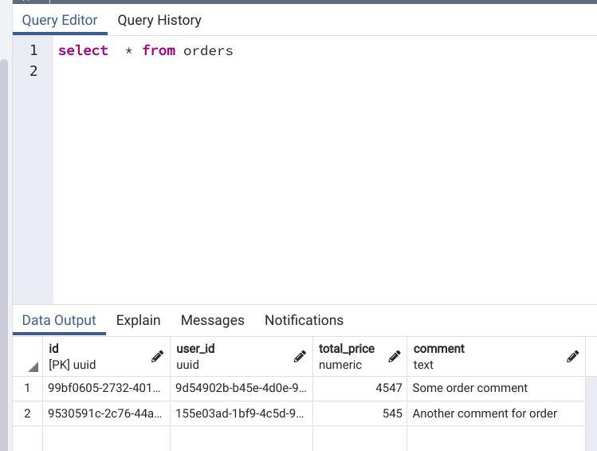
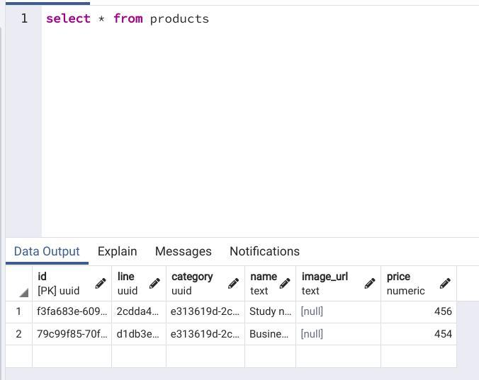
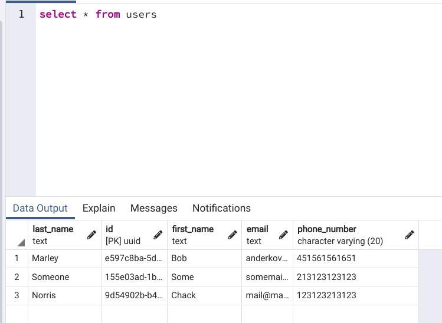
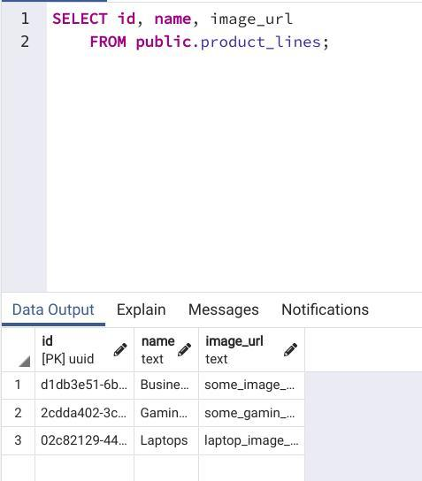
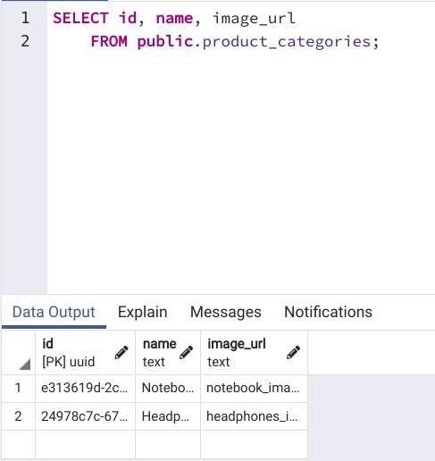

# Лаб 1 
## Проектування бази даних та ознайомлення з базовими операціями СУБД PostgreSQL

| Cтудент   |      Група      |  Варіант |
|----------|:-------------:|------:|
| Коваль Андрій |  КП-83 | Магазин |

   

### ERD

### Структура нормалізованої бази даних з назвами таблиць та зв’язками між ними

### Дані в таблицях в pgAdmin4

- __orders__

  

- __products__

  

- __users__

  

- __lines__

  

- __categories__

  

